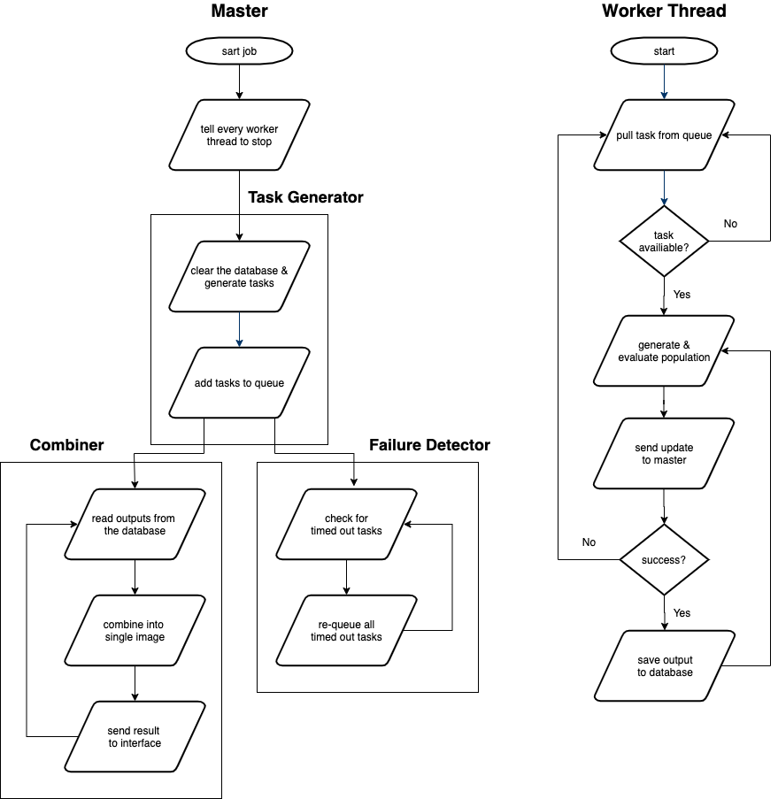
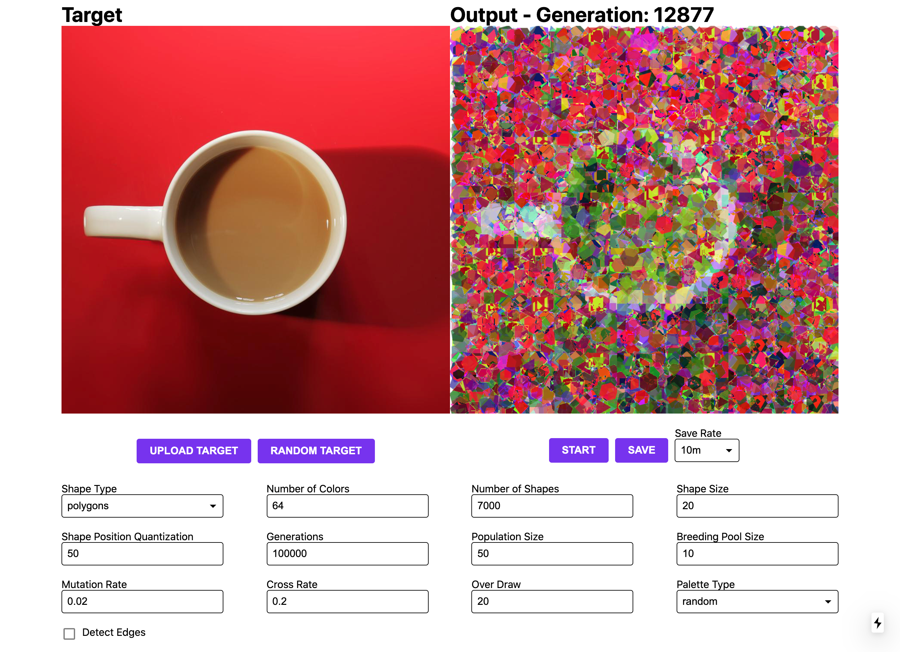
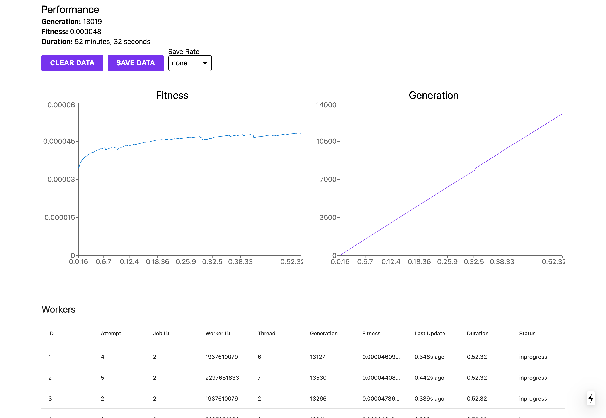

# Distributed Evolution

Genetic algorithms are a problem solving technique based on Darwin’s theory of evolution. First, random solutions are generated to make up a population. Each solution is evaluated for fitness, and the best fitting solutions are selected as the breeding pool. The next generation is created by randomly mixing components from members of the breeding pool, as well as adding a bit of extra randomness called mutation. These algorithms are not very efficient, but they can produce interesting results. [John Muellerleile](https://www.youtube.com/watch?v=JNP8NyiklAU) has produced especially interesting results using a distributed system to speed up the process. The goal of this project is to build an efficient system for evolving pixels towards a target image, based on John Muellerleile’s system, with added fault-tolerance.


## Development
With `docker-compose`
```shell
docker network create distributed-ga
make start
```

Or with minikube:
```shell
minikube start --driver=hyperkit
minikube addons enable ingress
make build-apply
```

Be sure to update your `/etc/hosts` file with `IP distributed.ga` 
where `IP` is the ingress-controller IP from
```shell
kubectl get ingresses
```

redis testing: https://itsmetommy.com/2018/04/13/docker-compose-redis/


## Deployment
The system can be deployed to any cloud provider that supports Kubernetes, such as GCP. The UI is best run locally or on [Vercel](vercel.com). 

### Build Images
```shell
make gocv # base image for running gocv in docker
make # application service images
```

### Setup
```shell
gcloud compute addresses create distributed-evolution-ip --global
gcloud container clusters create distributed-evolution --num-nodes=6 --machine-type n1-highcpu-4
gcloud container clusters get-credentials distributed-evolution
```

Configure `API_URL` and `CHANNEL_URL` in `deployment/prod/ui-deployment.yaml` based on the output of
```shell
gcloud compute addresses describe distributed-evolution-ip
```

Alternatively, configure `ui/docker-compose.yml` and run `docker-compose up` from `./ui`

### Deploy
```shell
kubectl apply -f deployment/prod
```

### Scale
```shell
gcloud container clusters resize distributed-evolution --num-nodes 8
```

### Cleanup
```shell
gcloud container clusters delete distributed-evolution
gcloud compute addresses delete distributed-evolution-ip --global
```


## TODO

Class:
- Debug production environment.

Fun:
- Shrink the solution space - https://github.com/hybridgroup/gocv
    - adjust shape type on lines
    - use slices of different image


# Design

The system is built as a collection of Docker containers. There is a master and many workers all running the main Golang project. There’s a set of containers dedicated to running a highly available Redis Sentinel cluster. Lastly, there is a container that runs the UI for managing jobs, and collecting results. Data flows from the UI, to the master, through Redis to worker threads and back again.





## Master

The master communicates with the UI and oversees a job’s execution. The main components of the master are the task generator, failure detector, and combiner. To communicate with the UI and worker threads, the master acts as an HTTP, WebSocket, and RPC server; as outlined by the following list.

*   **HTTP POST  /job:** Stops work on the current job (if any) and starts work on the job described by the body of the request. Clears Redis and the master’s local state, then triggers the task generator.
*   **WS /subscribe:** Creates a new WebSocket connection. The master keeps the connection alive to send periodic updates to the UI.
*   **RPC UpdateTask:** Updates the task in the master’s local state. If the job ID in the request doesn’t match the master’s current job ID, or the task doesn’t exist in the master’s local state, or the task is in progress by a different worker thread, the master throws an error. Otherwise, the master updates its local state with the given data. The time is recorded for use by the failure detector.

The [Gorilla web toolkit](https://www.gorillatoolkit.org/) is used to support the HTTP and WebSocket server.


The task generator uses the job configuration from the UI to generate subtasks which can be worked on in parallel. Each task is added to the master’s local state and saved in Redis. The ID is then added to the task queue in Redis. 

After the task generator finishes, the failure detector and combiner are the primary function of the master. The failure detector periodically scans the master’s local state for timed out tasks. The master receives RPC updates from the workers, the time of each update is recorded, and later checked by the failure detector. If a task times out, the ID is again added to the task queue. If a false positive occurs, whichever worker thread sends the next update claims the task, and an update from any other worker is received, the master responds with an error. If a worker can’t update the master, it does not save anything to the database, stops, and checks the queue for new tasks. This behaviour guarantees only one thread will ever be working on a task at a time. The combiner periodically reads each task from Redis, combines the results into a single output image, then sends it to the UI with the master’s local state for tracking.

The master also saves its local state to Redis periodically. If the master crashes, this makes it possible to continue work on the current job when a new master starts up. On startup, it checks the database for a state snapshot. If one exists, the master restores its state, requeues the tasks, and continues job progress. 


## Worker Threads

Worker threads run the genetic algorithm. Each worker spawns a number of threads to work on a separate task. Each thread starts by requesting a task ID from the task queue. If there is one available, the worker thread initializes the GA engine and begins processing the task. If there is no work available, the thread sleeps and tries again. If a thread receives a task that has been previously worked on, the initial population for the GA is taken from the task data rather than generated randomly. After each generation, the task status is sent to the master with the UpdateTask RPC and the task output is saved to Redis. If UpdateTask throws an error, the worker thread stops working on the task, and begins to poll the queue for new tasks. Two packages at the core of the worker threads are [EAOPT](https://github.com/MaxHalford/eaopt), the genetic algorithm engine, and [Go Graphics](https://github.com/fogleman/gg), the drawing library.


## Redis

Redis is used to share task data between the master and workers, queue tasks, and save master state snapshots for recovery. Each task is saved in Redis as a JSON string with key task:ID. The task queue is a list of unassigned task IDs. This decouples task generation and management from task assignment, removing the need for worker threads to request work from the master directly. As a task is worked on, the latest population and current best fitting output are saved to Redis. Doing this allows the UpdateTask RPC arguments to be minimal, reducing unnecessary blocking data transfer between the workers and master. The output is read from Redis at a reduced rate by the combiner. Lastly, Redis is used to periodically save the master’s state as a snapshot. This snapshot can later be used to restore the state after a crash. 

[Redis](https://redis.io/) was chosen as the database because it is fast, single threaded, and can be configured for high availability. The entire database is stored in memory, making read and writes very fast. Since Redis is single threaded, all commands are run in serial, eliminating the need for synchronization techniques like a distributed lock. [Redis Sentinel](https://redis.io/topics/sentinel) provides easy master-slave replication and automatic failover (leader election). 


## UI

The UI allows a user to start a job and monitor its progress. The output is displayed next to the target image, and each worker thread is displayed in a table. The UI is built with TypeScript; [NextJS](https://nextjs.org/) a [ReactJS](https://reactjs.org/)framework; and [RebassJS](https://rebassjs.org/), a minimal UI component library. 


# Containerization & Deployment

Each component is designed to run as a [Docker](https://www.docker.com/) container with [Docker Compose](https://github.com/docker/compose). Compose makes it easy to design containerized services for development. This is only a simulated distributed environment though. To take advantage of the distributed design, the application needs to be deployed to a cloud cluster like [Kubernetes](https://kubernetes.io/). [Kompose](https://github.com/kubernetes/kompose) can be used to convert the Compose file to Kubernetes configuration files.


# Testing

The containerized design of the system makes it easy to test fault tolerance. A Docker container can be paused with `docker pause <containerID|containerName>`. Redis fault-tolerance can be tested with `docker pause distributed-evolution_redis-master_1`. Redis Sentinel will automatically elect a new master from the redis slaves, and the system will continue work on the current job with little interruption. Worker fault-tolerance can be tested with `docker pause distributed-evolution_worker_1`.  The tasks the worker was working on will each timeout, re-queued, and then picked up by a new worker thread. The system does not handle master node crashes. If the master crashes, the system halts, and all workers return to polling for new work. 


# Results

The system is stable and mostly fault-tolerant. It has run on a job for 8 hours, processing over 80,000 generations. While the output definitely seems to be approaching the target image, it is still too slow to see good results within a reasonable amount of time. The outputs from the 8 hour experiment are shown in **Figure 2**. 

<div style="display: inline;">
    
</div>
<div style="display: inline;">
    
</div>
<div style="display: inline;">
    
</div>
<div style="display: inline;">
    
</div>
<div style="display: inline;">
    
</div>

**Figure 2.** Screenshots of the UI from the 8 hour experiment.


The system has potential, but needs to be deployed to a cloud cluster to take advantage of the distributed design. One thing that could be done to greatly improve the output is reducing the solution space. Essentially, this means to reduce the number of possibilities within the randomness. This could be done by reducing the number of colors available, using a subset of colors from the target image, or using precomputed slices of an entirely different image. Another thing that could be done is running line detection on the target image, and then treating pixels on an edge differently than others. These concepts are covered in more detail by John Muellerleile in his talk [**An Adventure in Distributed Systems, Genetic Algorithms & Art**](https://www.youtube.com/watch?v=JNP8NyiklAU). However, these optimizations are beyond the scope of Phase I of this project, and focus has been on making the system fault tolerant and scalable. 

# Screenshots




